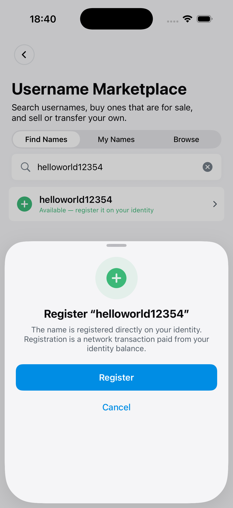
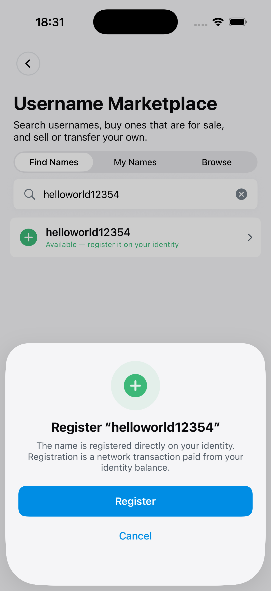

# Pull request 1065 visual evidence

This branch stores the full-resolution simulator evidence for
[`dashpay/dashwallet-ios#1065`](https://github.com/dashpay/dashwallet-ios/pull/1065).

| State | Exact revision | Simulator | SHA-256 |
| --- | --- | --- | --- |
| Before | `53bb20d70f53e981bd0eba27a3185982b7318e33` | Marketplace Sheet Before (`EE3A1FF6-5E2C-4496-9513-F4E8F638CEF2`) | `f5104bf3a9023ceb7907956d3ada6617c53ee0f1464c9985bb6776187982b9de` |
| After | `e5ef8b13e2c4b379074721ef79eaeb1c2fbadf1f` | Marketplace Sheet After (`6A442DE3-4100-4AA3-9E9C-F7364EC20DD6`) | `2eb164a9d1a62c062e2d83e5bde6f5fda23aed46bd7b5b1c20a11dba38330ce5` |

Both simulators were cloned from the same configured `Compare - Auto Receive`
fixture (`58AE006C-D6D9-4CF4-AF26-56FFAC0CB063`), run on iOS 26.5, and show the
same `helloworld12354` standard registration flow at 1206 × 2622 pixels.

## Before — exact base

## After — full PR head

