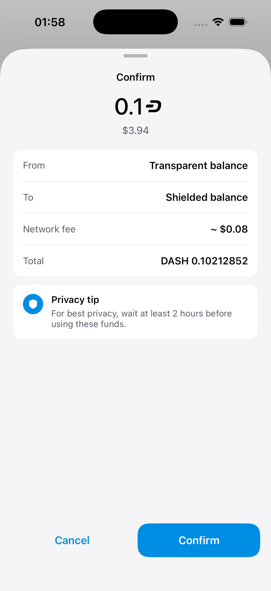
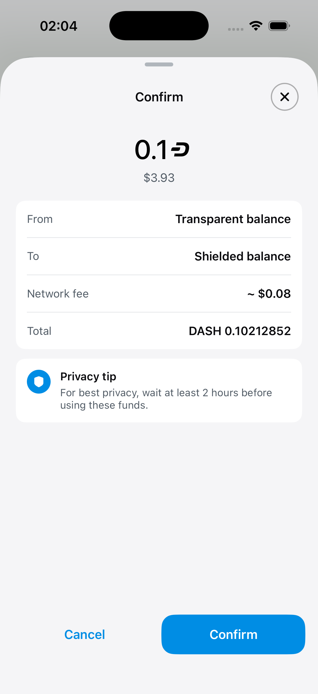
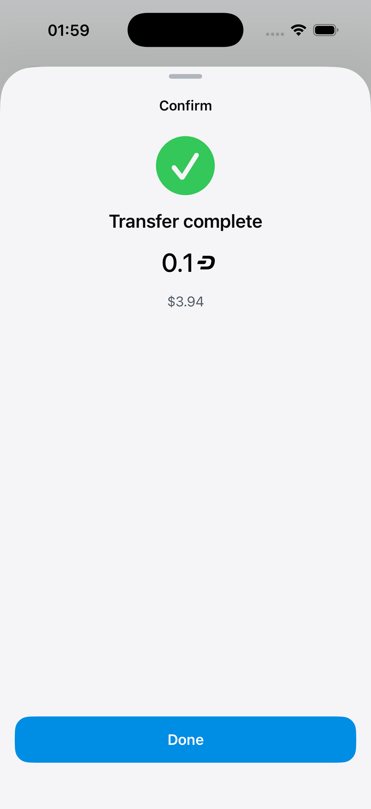
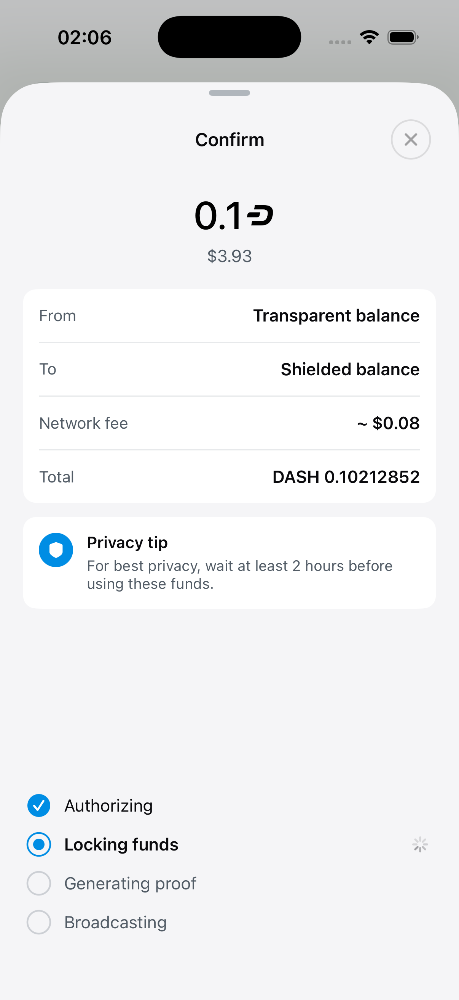

# DashUIKit protected-sheet migration evidence

This evidence compares the exact stacked base of the protected-sheet migration with its
full implementation head.

| Role | Dash Wallet revision | DashUIKit revision | Simulator |
| --- | --- | --- | --- |
| Before — exact base | `bb34895b65769d5849b97aea56adb39dcf3c6982` | `5b373b141054438e94903af52b9ec324f1efbdb2` | DashUIKit PR4 Before bb34895b6 (`0F16A692-078C-4EAC-B806-A103F6F8F73F`) |
| After — full head | `9198db97fe6f58f69efcfa5d7062d59530800463` | `e8d92434bfc28fbf933b896cd40a01dd61835b5f` | DashUIKit PR4 After 9198db97f (`8D562FC5-9636-4896-A5C0-D3746904EA21`) |

The after device is a clone of the same shut-down wallet fixture represented by the before
device. Both run iOS 26.5 and use bundle identifier `org.dashfoundation.dash`. Each revision
was built independently with normal Simulator signing and separate DerivedData. The app
built, installed, launched, and remained alive on both devices.

Both testnet transfers use the same transparent-to-shielded route, 0.1 tDASH amount,
0.10212852 DASH total, and approximately $0.08 network fee. The fiat quote changed by $0.01
between capture times. The protected pair captures the same locking phase. These
transactions share the same testnet wallet and therefore become visible to both devices
after broadcast.

## Idle confirmation

The head replaces the wallet-owned grabber/title shell with the shared DashUIKit header and
its close affordance while preserving the confirmation content and host-owned cancellation.

| Before — exact base | After — full head |
| --- | --- |
|  |  |

## Protected locking phase

Both revisions prevent swipe dismissal during the operation. The head routes that protection
through DashUIKit and visibly disables the standardized close control at the same time. During
capture, accessibility reported the head's `Close` button as disabled; the base custom sheet
has no close control.

| Before — exact base | After — full head |
| --- | --- |
|  |  |

The same API wiring is compiled into send confirmation, shielded recovery, CoinJoin move
funds, evonode withdrawal, and username registration sheets. Marketplace name detail,
set-price, and transfer remain native detented sheets with native interactive-dismissal
protection. DashUIKit's focused tests cover disabled/default/custom close routing; this
wallet evidence demonstrates the representative host integration.

## Files

All images are unmodified 1206×2622 PNG screenshots inspected at original resolution.

| File | SHA-256 |
| --- | --- |
| `comparison/before/internal-transfer-idle.png` | `052a574c7a469529230ba7a78cd0605238ff9053fbed039095d6daf5b38b74fd` |
| `comparison/after/internal-transfer-idle.png` | `c5b9f390ec6ef1107806813b4bccf6256673fb1736e973f9c08c1dd1cd6980c4` |
| `comparison/before/internal-transfer-protected.png` | `c5b96567e8d6fee017f272af0604a62e549775ed6844740a42ba73c816adacb8` |
| `comparison/after/internal-transfer-protected.png` | `32bf866d09497f9523a46579c87915f1343312a38d042d1bdba9878d81b9c3e0` |
