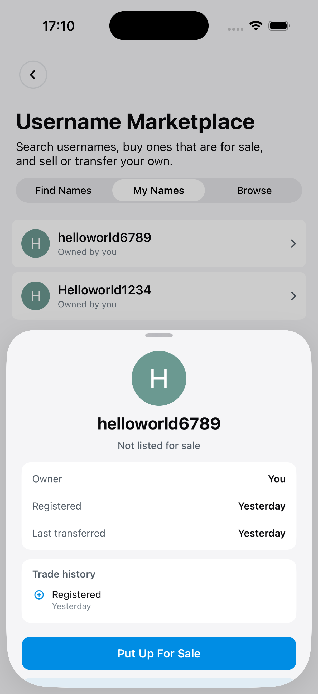
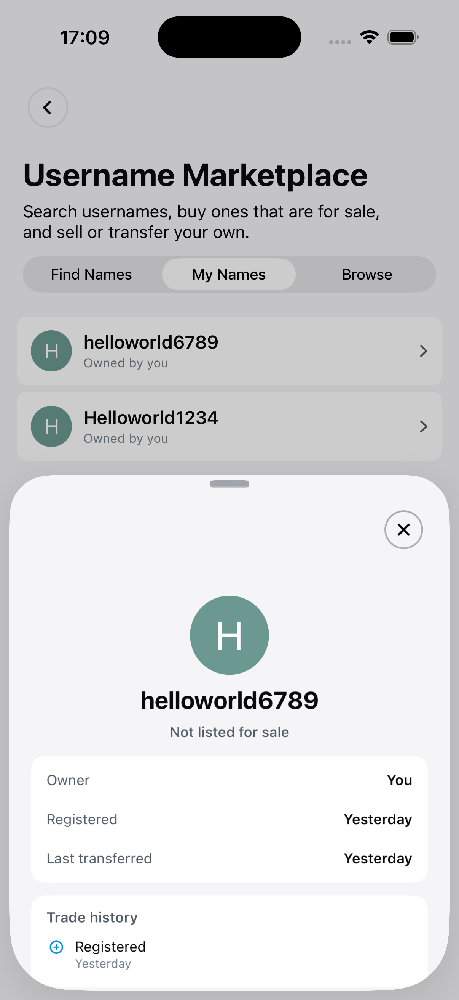
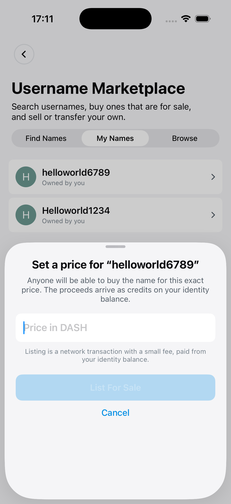
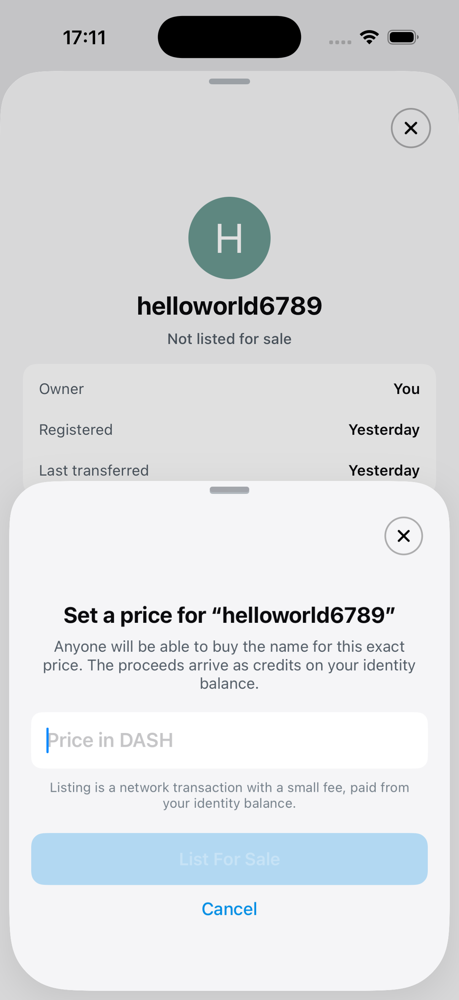

# DashUIKit bottom-sheet consolidation visual evidence

This orphan branch stores the full-resolution iOS Simulator evidence for the
Dash Wallet bottom-sheet foundation migration to `DashUIKit.BottomSheet`.

## Provenance

| State | Exact revision | Simulator |
| --- | --- | --- |
| Before | `be25f358d9f606103d4da956c1310d756d436070` | DashUIKit PR1 Before be25f358d (`3DD208A7-27A7-484B-B5A1-E71DCFE88EA3`) |
| After | `da64754531a36be79756f03140380be540056459` | DashUIKit PR1 After da6475453 (`9462A942-59F2-4962-AF3F-EE911A9A05D9`) |

Both simulators were cloned while shut down from the same configured
`PR 1067 After a2b9f1f` fixture
(`46345DF3-5747-4886-9539-18206110B245`). Each exact revision was built in an
independent worktree with separate DerivedData, installed on its corresponding
clone, launched successfully, and verified live before navigation. The captures
are unedited `simctl io screenshot` PNGs from an iPhone 17 Pro on iOS 26.5 at
1206 × 2622 pixels.

## File integrity

| Surface | Before SHA-256 | After SHA-256 |
| --- | --- | --- |
| Transaction filter | `1aab0333ead05e0617975712d0c9fbbe532421b776865521fef03a156a05e71f` | `abb39896a978afd932d37fff9c311276b51cb1b8133e10c275da2c94282e0cf0` |
| Transaction detail | `761c3ae031a462b4819b76d0d9d4184bc3da6a19ebc2d576ccd5f3764fe3239b` | `aff34298f5a9568b6028ddd67fc2eeec4fe2d607f61a5ffec84a153a06c295fd` |
| Marketplace name detail | `c22fd7ffa7a58a2122d5b987d48035e07cac7af82247dc70c2f13a4e6e8a008c` | `3215000a378265fd5017c685db3203ca789c99d9a051b415c84a9c9db3130e27` |
| Marketplace set price | `2941375a15441a1f8526e6eeb9d8b17f2a6df507c1f18f3aa58e18ef75ade926` | `33ffa6ae0c9a1de292fbfde9a6aa885cad03af7748d68b052f4cdf15bccb3eb3` |

## Transaction filter

| Before — exact base | After — full head |
| --- | --- |
|  |  |

## Transaction detail

| Before — exact base | After — full head |
| --- | --- |
|  |  |

## Marketplace name detail

| Before — exact base | After — full head |
| --- | --- |
|  |  |

## Marketplace set price

| Before — exact base | After — full head |
| --- | --- |
|  |  |
