# DashUIKit sheet-content migration visual evidence

This orphan branch stores the full-resolution iOS Simulator evidence for the
second Dash Wallet bottom-sheet migration PR. It covers the dismiss-safe sheet
content moved onto `DashUIKit.BottomSheet`.

## Provenance

| State | Exact revision | Simulator |
| --- | --- | --- |
| Before | `ab566189742eb386516e9fc4c2d9e940d577a749` | DashUIKit PR2 Before ab5661897 (`9462A942-59F2-4962-AF3F-EE911A9A05D9`) |
| After | `bb34895b65769d5849b97aea56adb39dcf3c6982` | DashUIKit PR2 After bb34895b6 (`0F16A692-078C-4EAC-B806-A103F6F8F73F`) |

Both simulators were cloned while shut down from the same configured
`PR 1067 After a2b9f1f` fixture
(`46345DF3-5747-4886-9539-18206110B245`). Each exact revision was built in an
independent worktree with separate DerivedData, installed on its corresponding
clone, launched successfully, and verified live before navigation. The captures
are unedited `simctl io screenshot` PNGs from an iPhone 17 Pro on iOS 26.5 at
1206 × 2622 pixels.

The wallet fixture and displayed Dash balances match across each pair. Fiat
quotes are live and changed between capture times. Each pair shows the same
screen content before and after the wallet-owned sheet chrome was replaced by
the shared DashUIKit grabber, header, and close affordance.

## File integrity

| Surface | Before SHA-256 | After SHA-256 |
| --- | --- | --- |
| Balance info | `0a6a55e37f62a13555ad987a9ebe3c1a934a6e1d4602fbfa2831b969ad2a88d1` | `12990ed9e0ecd6843e20c5b09fc0ac2da58e88ee2967fdb2caa15adc15c9aa1a` |
| CSV export | `eaf83ee40876819a7474880c12399c279401acc1ceeec5696425836d076ba8aa` | `41c787298687d8159e89c4efe60ef8c17b645e1e0339d7c873132ca032d30a19` |
| Extended public key | `73f366e353a6ab5a13b99798339418bfdea8202deb83260c397877933cd93271` | `b5b1a0c03ec51e305538ab30589419e26242ec622e80bfe94e15a4702a210f50` |
| ZenLedger | `da89aa90043f6955349ce9e35b3086341c9bed789f5f378e8790c89760774153` | `e196dbb751a8d97488d1ed635cbe73af22e63d7ca251f083668b141366a8287b` |
| Transfer timing | `046a696a2b77dc101cb3faf4f68976b9282614cc938db96ee5c2815415a5773f` | `33967b0039b7e99204a31617d04dfb357e089e0855f146d76018daacbb4338b3` |
| Transfer endpoint picker | `703bf151142ff73a0468842f10d043efe49589fa38473b32db62634cb2d2c103` | `cf55b14f0df849753c5dec69f5669478ba3db90a727e0d13fa0cd787e3c2ab5a` |

## Balance info

| Before — exact base | After — full head |
| --- | --- |
| 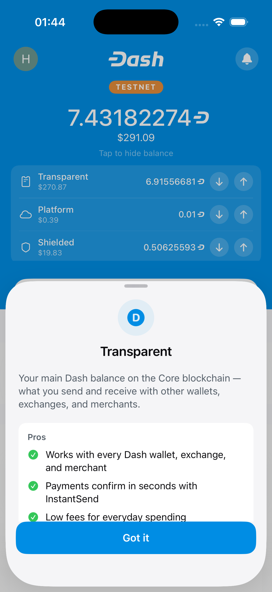 | 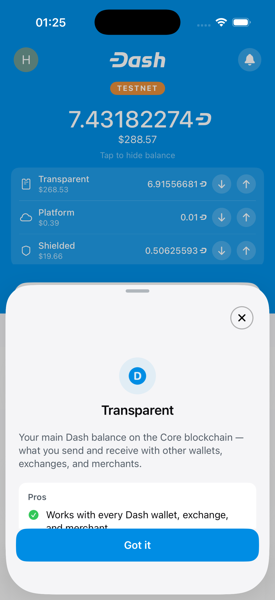 |

## CSV export

| Before — exact base | After — full head |
| --- | --- |
| 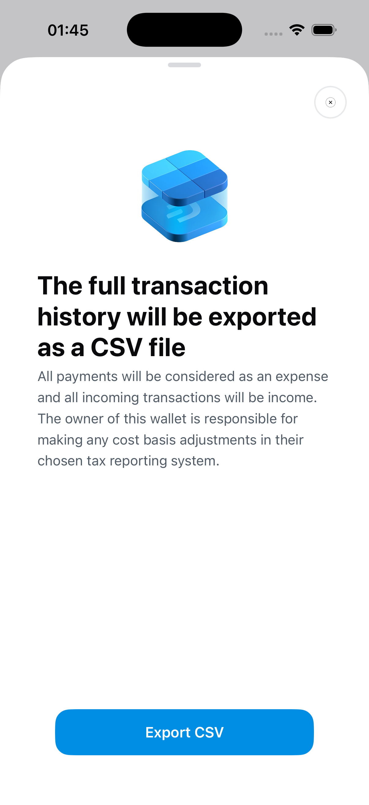 | 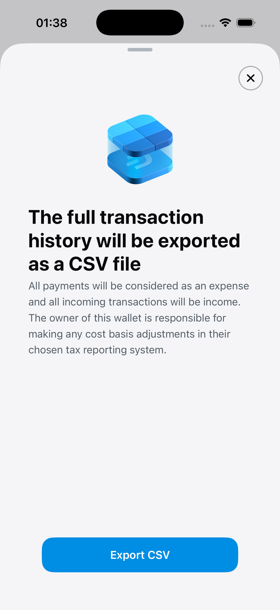 |

## Extended public key

| Before — exact base | After — full head |
| --- | --- |
| 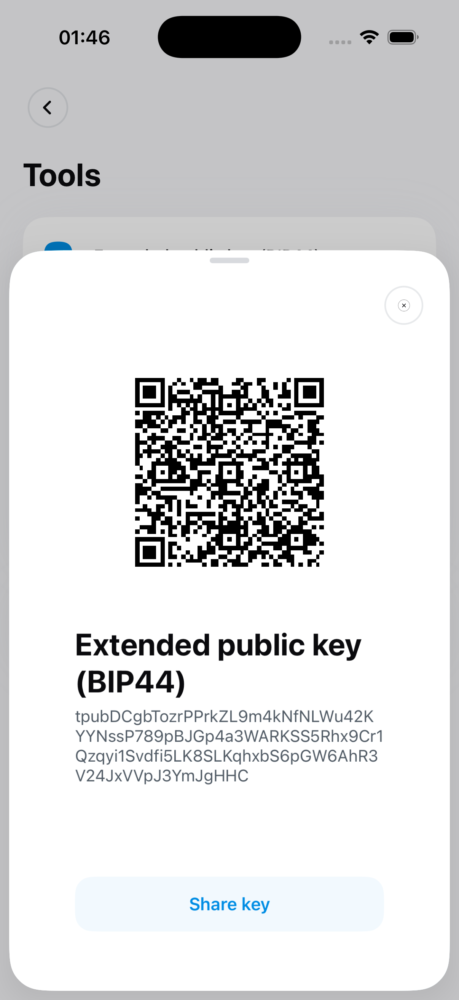 | 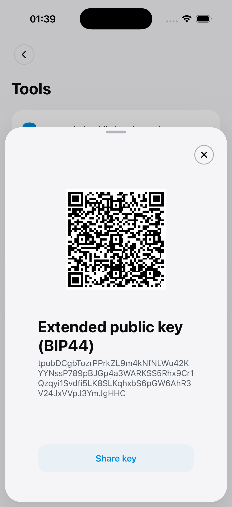 |

## ZenLedger

| Before — exact base | After — full head |
| --- | --- |
| 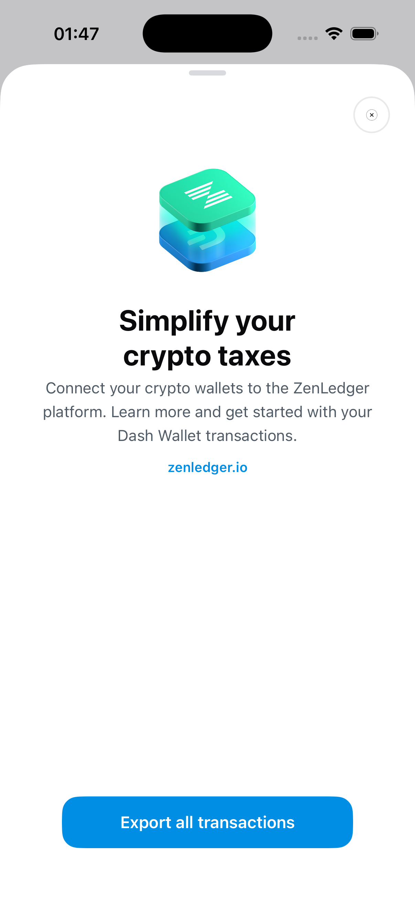 | 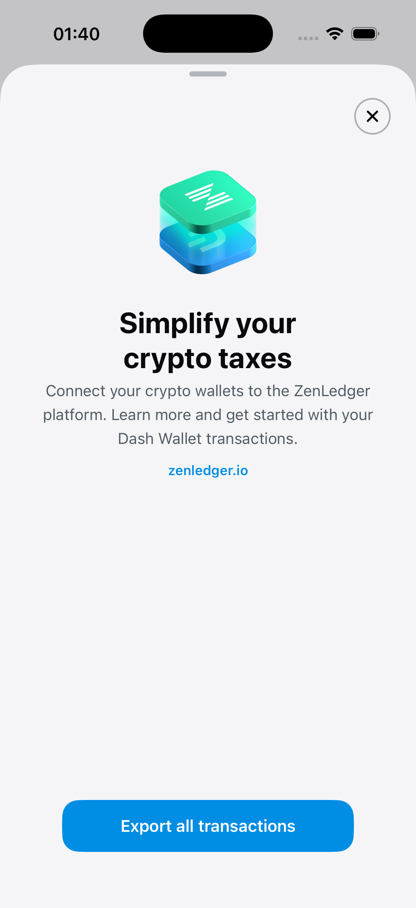 |

## Transfer timing

| Before — exact base | After — full head |
| --- | --- |
| 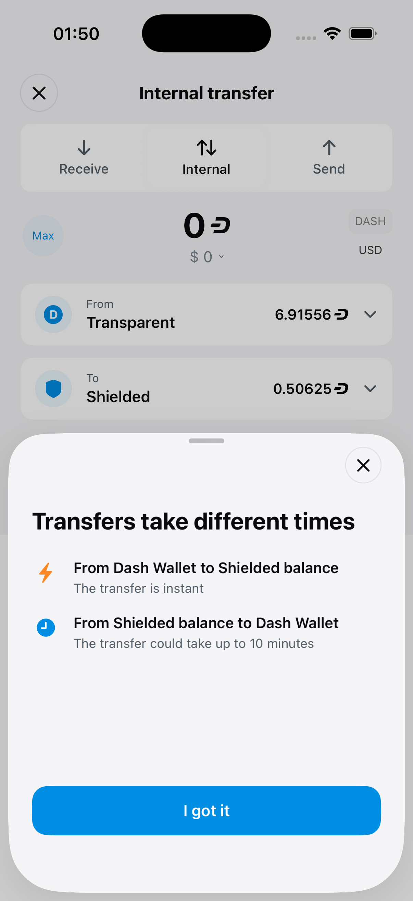 | 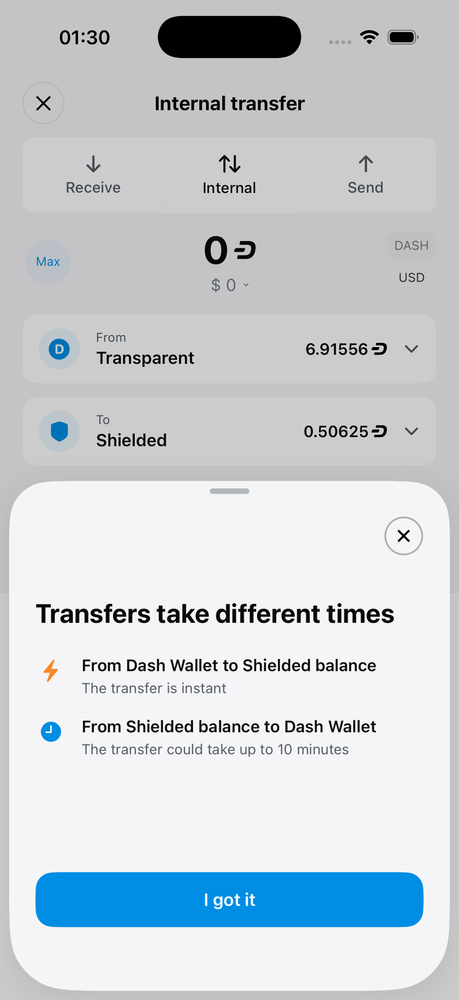 |

## Transfer endpoint picker

| Before — exact base | After — full head |
| --- | --- |
| 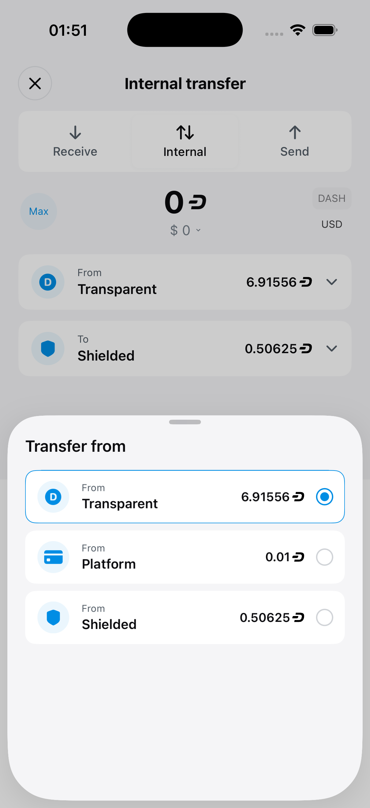 | 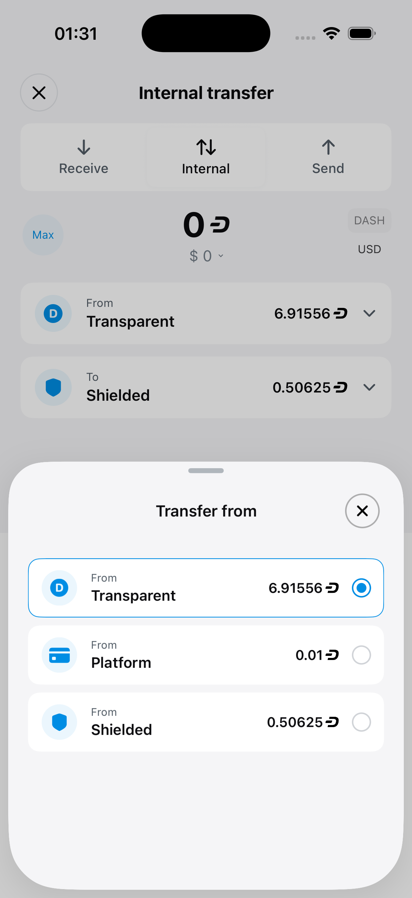 |
